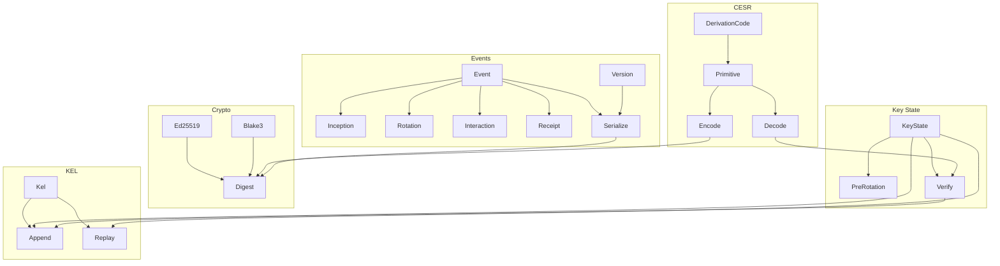

# Architecture

## Module structure

## Module list

| Module | Description |
|--------|-------------|
| `Keri.Cesr.DerivationCode` | CESR code table: `D` (Ed25519 key), `E` (digest), `0B` (signature) |
| `Keri.Cesr.Primitive` | Qualified primitive: derivation code + raw bytes |
| `Keri.Cesr.Encode` | Primitive to base64url text |
| `Keri.Cesr.Decode` | Base64url text to primitive |
| `Keri.Crypto.Ed25519` | Key generation, signing, verification via `crypton` |
| `Keri.Crypto.Blake3` | Blake2b-256 hashing (stand-in for Blake3) |
| `Keri.Crypto.Digest` | SAID (Self-Addressing Identifier) computation |
| `Keri.Event` | Event sum type and data records |
| `Keri.Event.Inception` | Inception event construction with SAID |
| `Keri.Event.Rotation` | Key rotation event |
| `Keri.Event.Interaction` | Non-key-change interaction event |
| `Keri.Event.Receipt` | Direct-mode receipt |
| `Keri.Event.Serialize` | Deterministic JSON via ordered `pairs` |
| `Keri.Event.Version` | Version string: `KERI10JSON{size:06x}_` |
| `Keri.KeyState` | Key state record and `applyEvent` state machine |
| `Keri.KeyState.PreRotation` | Pre-rotation key commitment via Blake2b-256 digest |
| `Keri.KeyState.Verify` | Indexed signature verification against threshold |
| `Keri.Kel` | KEL and SignedEvent types |
| `Keri.Kel.Append` | Append with signature and chain verification |
| `Keri.Kel.Replay` | Replay KEL to derive current key state |

## Key design decisions

- **Deterministic JSON**: `Data.Aeson.Encoding.pairs` with explicit field ordering (not HashMap)
- **SAID**: Serialize with 44-char `#` placeholder in `"d"` field, hash, replace. For inception: `"i"` = `"d"` (self-addressing)
- **Pre-rotation**: Each next-key commitment = `blake2b_256(publicKeyBytes)`, CESR-encoded as digest
- **Version string**: Fixed 6-hex-digit size field avoids the chicken-and-egg sizing problem
- **Indexed signatures**: `[(Int, Text)]` where index maps to position in the key list
