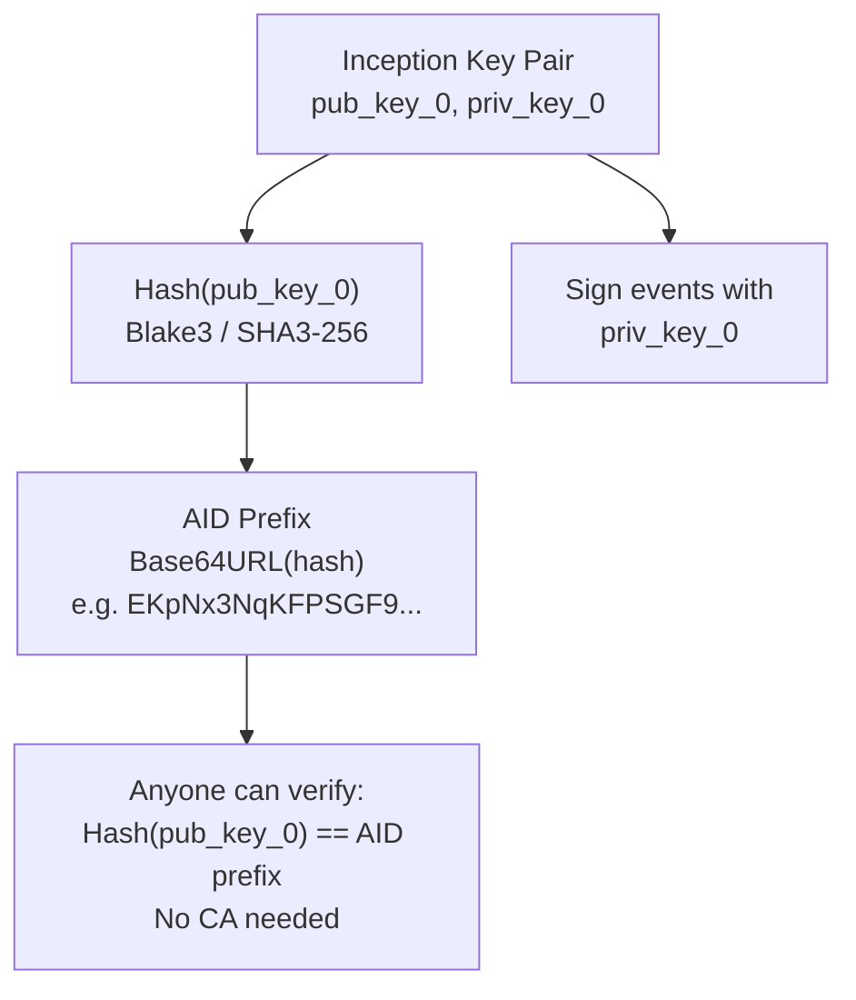
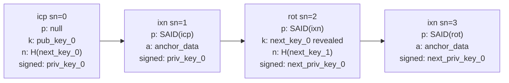
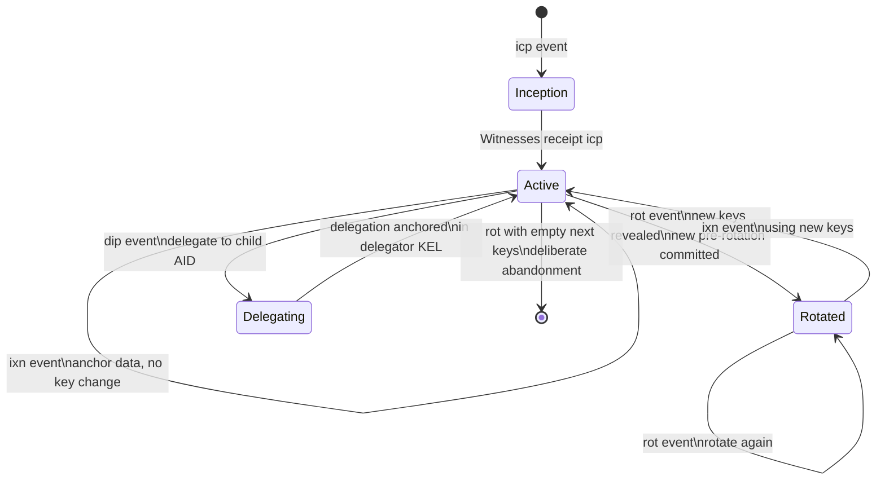
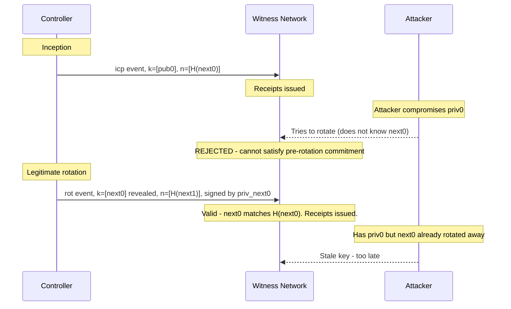
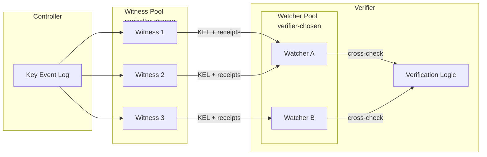
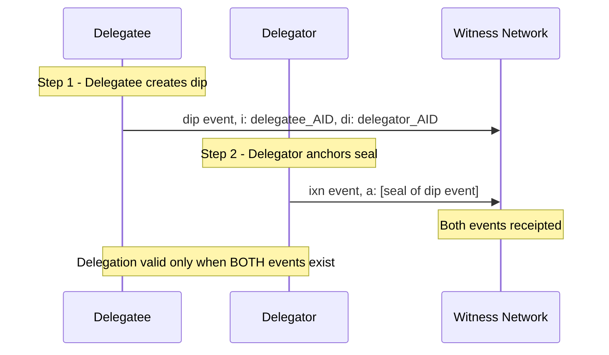
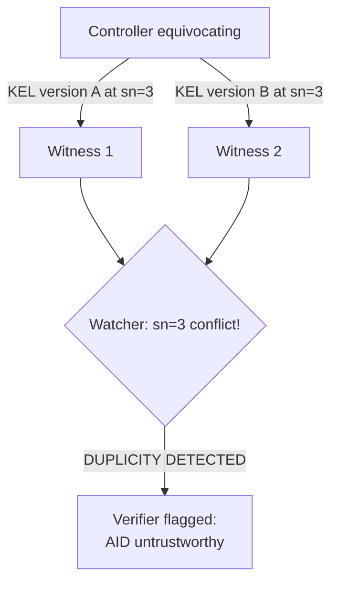
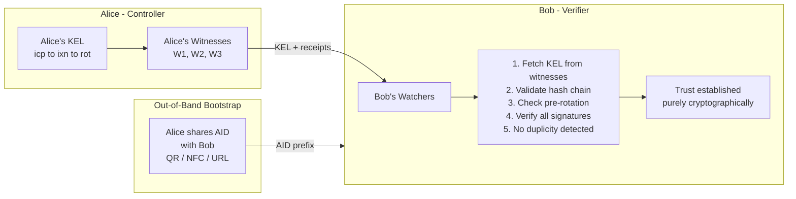
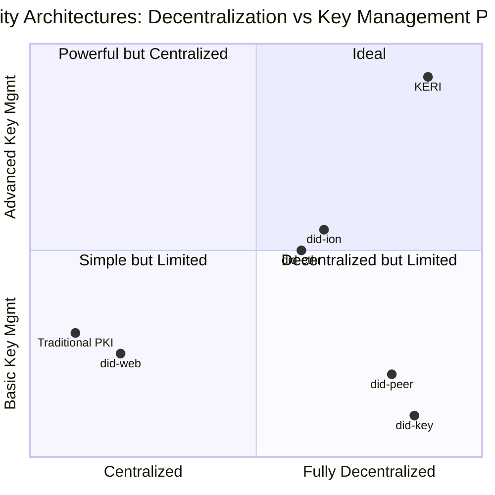
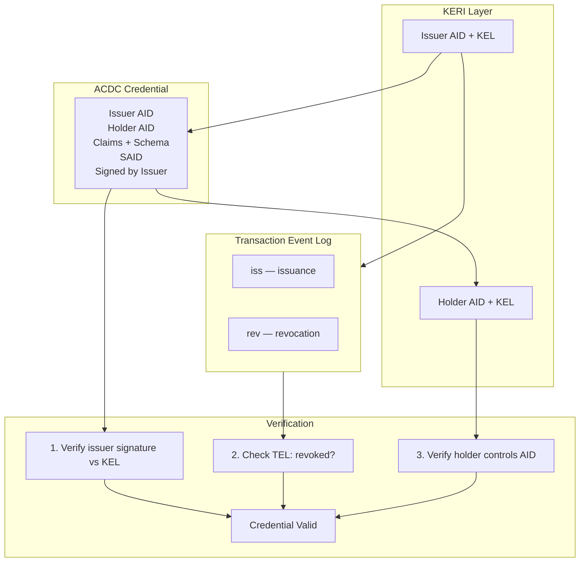

# KERI Protocol: A Deep Introduction

> **Key Event Receipt Infrastructure** — a decentralized identity protocol built on cryptographic autonomy, portability, and verifiability without dependence on any ledger or registry.

---

## Table of Contents

1. [Motivation and Design Philosophy](#1-motivation-and-design-philosophy)
2. [Core Concepts](#2-core-concepts)
3. [Key Event Log (KEL)](#3-key-event-log-kel)
4. [Event Types](#4-event-types)
5. [Key Management and Rotation](#5-key-management-and-rotation)
6. [Witnesses and Watchers](#6-witnesses-and-watchers)
7. [Delegation](#7-delegation)
8. [Duplicity Detection and the KERI Security Model](#8-duplicity-detection-and-the-keri-security-model)
9. [Trust Hierarchy Without a Ledger](#9-trust-hierarchy-without-a-ledger)
10. [KERI vs Other DID Methods](#10-keri-vs-other-did-methods)
11. [ACDC: Authentic Chained Data Containers](#11-acdc-authentic-chained-data-containers)
12. [Implementation Landscape](#12-implementation-landscape)
13. [Strengths and Tradeoffs](#13-strengths-and-tradeoffs)
14. [Quick Reference Glossary](#14-quick-reference-glossary)

---

## 1. Motivation and Design Philosophy

KERI was created by Samuel M. Smith (Ph.D.) and first published in a 2019 white paper. The fundamental problem it addresses is: **how can an entity control its own cryptographic identifier without depending on any external registry, blockchain, or certificate authority?**

Traditional PKI ties identity to a CA-signed certificate. Blockchain-based DID methods (did:ethr, did:ion, etc.) tie identity to a specific ledger. Both approaches introduce **infrastructure dependency** — the identity is only as portable and available as the underlying infrastructure allows.

KERI's design principles are:

- **Self-certifying identifiers (SCIs)**: the identifier itself is derived from the public key, so no external authority is needed to bind key to identity.
- **Cryptographic autonomy**: the controller always retains the ability to prove control through private key possession.
- **Portability**: a KERI identifier and its Key Event Log can be replicated anywhere; no single infrastructure point of failure.
- **Minimal sufficient means**: avoid complexity; use only what is necessary to achieve security goals.
- **End-verifiability**: any verifier can independently validate the entire history of an identifier by replaying the Key Event Log.

KERI is not a blockchain, not a DID method (though it can be expressed as one: `did:keri`), and not a credential format — it is a **foundational identity layer** upon which all of these can be built.

---

## 2. Core Concepts

### 2.1 Autonomic Identifier (AID)

An **Autonomic Identifier (AID)** is a self-certifying identifier. It is derived directly from a public key (or a commitment to a set of keys in the multisig case):

```
AID = Base64URL( Blake3( public_key ) )   # simplified
```

More precisely, the AID is derived from the **inception key digest** — a cryptographic hash of the initial controlling public key(s). This creates a permanent, unforgeable binding between the identifier and its controlling key material **at inception**.

No registry, DNS, or blockchain is consulted to verify this binding. The math alone is sufficient.



### 2.2 Pre-rotation

KERI's most important innovation is **pre-rotation**: at inception (and at each rotation), the controller commits to the *digest* of the *next* set of keys — before those keys are ever used or revealed.

```
Inception event:
  keys:      [current_pub_key_1, ...]
  next_keys: [hash(next_pub_key_1), ...]   <- commitment, not the key itself
```

This has a profound security implication: **even if an attacker compromises your current private key, they cannot perform a valid rotation** because they do not know the pre-committed next key, and cannot forge a valid digest preimage.

Pre-rotation elevates KERI's security model above traditional PKI and even most blockchain DID methods.

### 2.3 Establishment vs Non-establishment Events

KERI distinguishes two classes of events:

| Class | Purpose | Examples |
|---|---|---|
| **Establishment** | Change the key state | `icp`, `rot`, `dip`, `drt` |
| **Non-establishment** | Anchor data / interact | `ixn` |

Only establishment events change the authoritative key set. Non-establishment events (interactions) allow the controller to anchor arbitrary data (e.g., credential issuances, service endpoint changes) without rotating keys.

---

## 3. Key Event Log (KEL)

The **Key Event Log (KEL)** is the authoritative, append-only, cryptographically-chained log of all key management events for an AID. It is the single source of truth for the current key state of an identifier.

Each event in the KEL:

1. Contains a **sequence number** (`sn`)
2. Contains the **digest of the prior event** (`p`) — creating a hash chain
3. Is **signed** by the current authoritative key set
4. May reference a **digest of the next key set** (pre-rotation commitment)

```
Event_n:
  v:   version string
  t:   event type (icp | rot | ixn | ...)
  d:   SAID (self-addressing identifier = digest of this event)
  i:   AID (identifier prefix)
  sn:  sequence number
  p:   digest of prior event
  kt:  signing threshold
  k:   list of current public keys
  nt:  next key threshold
  n:   list of next key digests (pre-rotation)
  bt:  backer threshold
  b:   list of backers (witnesses)
  c:   config traits
  a:   anchored data (for ixn events)
```

The **SAID** (Self-Addressing IDentifier) is the digest of the event itself, computed after substituting a placeholder for the `d` field. This gives every event a globally unique, self-certifying identifier.

**KEL hash chain — each event commits to the prior event's digest:**



### KEL Verification

To verify a KEL, a verifier:

1. Validates the inception event: checks that the AID prefix matches the digest of the inception keys.
2. For each subsequent event: checks the prior event digest, verifies signatures against the current key state, verifies threshold satisfaction.
3. For each rotation: verifies that the new keys match the previously committed next key digests.

This verification is fully **end-to-end** and requires no external oracle.

---

## 4. Event Types

### `icp` — Inception
Creates the AID. Establishes the initial key set and the pre-rotation commitment to the next key set. The AID prefix is derived from this event.

### `rot` — Rotation
Rotates the key set. Must satisfy the signing threshold of the *current* key set AND reveal the pre-committed next keys. Establishes a new next-key commitment.

### `ixn` — Interaction
A non-establishment event. Signed by the current key set. Used to anchor arbitrary data (credential hashes, service endpoint changes, etc.) into the KEL without rotating keys.

### `dip` — Delegated Inception
Like `icp`, but for a **delegated AID**. The delegating AID must anchor a seal of this event in its own KEL, creating a two-way binding.

### `drt` — Delegated Rotation
Like `rot`, but for a delegated AID, requiring the delegator's co-signature.

**AID lifecycle state machine:**



---

## 5. Key Management and Rotation

### Thresholds and Multisig

KERI natively supports **weighted threshold multisig**. The signing threshold (`kt`) can be:

- A simple integer: `"kt": "2"` means 2-of-n
- A fractional weight list: `"kt": ["1/2", "1/2", "1/4"]` — more flexible M-of-N with weights

This allows sophisticated key ceremonies: HSM keys, hardware security keys, geographically distributed keys, and organizational key hierarchies.

### Key Compromise Recovery

With pre-rotation, recovery from a compromised current key is straightforward:

1. The attacker has the *current* private key but not the *next* private key (which was never exposed).
2. The controller uses the next key (whose digest was pre-committed) to sign a rotation event.
3. The KEL is updated. The attacker's key is revoked.
4. The controller commits to a new next key.

**Pre-rotation security: attacker cannot forge a rotation**



If *both* the current key and the next key are compromised simultaneously, recovery requires falling back to the **witness network** and potentially a social recovery process — KERI acknowledges this as a residual risk.

### Partial Rotation

KERI supports partial rotation: not all keys in a multisig set need to rotate simultaneously. This enables rolling key ceremonies without requiring all signers to be online at once.

---

## 6. Witnesses and Watchers

### Witnesses

A **witness** is a service that receives, validates, and receipts key events. Witnesses:

- Maintain a copy of the controller's KEL
- Issue **receipts**: signed acknowledgments that they have seen and validated an event
- Provide availability and consistency guarantees

The **backer threshold** (`bt`) specifies how many witness receipts are required before an event is considered sufficiently witnessed. This threshold is established at inception and can be updated at rotation.

Witnesses do **not** control the identifier — they merely attest to having seen events. Their role is analogous to notaries or timestamping services, but cryptographically stronger.

### Watchers

**Watchers** are verifier-side infrastructure. They monitor multiple KELs and detect duplicity (see below). Unlike witnesses (which are chosen by the controller), watchers are chosen by the **verifier**.

This creates a **two-sided trust model**: controllers choose witnesses, verifiers choose watchers. Neither side can unilaterally subvert the system.



---

## 7. Delegation

KERI supports **cryptographic delegation**: an AID can delegate key management authority to another AID. This is the foundation for building organizational hierarchies and enterprise key management systems.

A delegation relationship requires:

1. The **delegatee** creates a `dip` (delegated inception) event.
2. The **delegator** anchors a seal (hash reference) of the `dip` in its own KEL via an `ixn` or `rot` event.
3. Both events must exist and be verifiable for the delegation to be valid.

This mutual anchoring creates a **bi-directional cryptographic binding**. You cannot forge a delegation without compromising both the delegatee's keys and the delegator's keys simultaneously.



---

## 8. Duplicity Detection and the KERI Security Model

### The Duplicity Problem

A malicious controller (or attacker) might try to present **two different versions of a KEL** to different parties. KERI addresses this through the **watcher network** and **First Seen** ordering.



### Duplicity is Detectable, Not Preventable

KERI does not claim to *prevent* duplicity — it claims to make duplicity **detectable and attributable**. Once a controller is caught equivocating, their identifier is effectively poisoned: no rational verifier will trust them.

This is analogous to Bitcoin's security model for double-spend: the network doesn't prevent you from *trying*, but it makes the attempt detectable and economically irrational.

### The KERI Security Assumptions

KERI's security reduces to two assumptions:

1. **Cryptographic hardness**: hash functions and digital signatures are secure (standard assumption).
2. **Witness honesty threshold**: a sufficient number of witnesses are not colluding with an adversary. With a well-chosen diverse witness set, this is a very mild assumption.

Notably, KERI does **not** assume Byzantine fault tolerance, economic incentives (no token required), or trusted third parties.

---

## 9. Trust Hierarchy Without a Ledger

Traditional PKI requires a root CA. Blockchain DIDs require a canonical ledger state. KERI requires neither.

Instead, KERI uses a **TERD (Trust Extending Root of Discovery)** approach: Alice gives Bob her AID out-of-band; Bob resolves Alice's KEL from Alice's witnesses; Bob's watcher monitors for duplicity; all subsequent verifications are purely cryptographic.

The root of trust is **the inception event** and the **key ceremony** that produced it.

**End-to-end trust flow:**



---

## 10. KERI vs Other DID Methods

| Feature | did:key | did:ethr / did:ion | did:keri |
|---|---|---|---|
| Self-certifying | Yes | Partial | Yes |
| Key rotation | No | Yes (on-chain) | Yes (off-chain) |
| Pre-rotation | No | No | Yes |
| Ledger dependency | No | Yes (hard) | No |
| Censorship resistance | N/A | Depends on chain | Yes |
| Multisig | No | Partial | Yes (native) |
| Delegation | No | No | Yes (cryptographic) |
| Verifiable offline | Yes | No | Yes |
| Long-term key management | No | Partial | Yes |
| Infrastructure cost | None | High (gas) | Low (witnesses) |



---

## 11. ACDC: Authentic Chained Data Containers

KERI provides the **key management layer**. **ACDC** (Authentic Chained Data Containers) is the **credential layer** built on top.

An ACDC is a signed, self-describing data container: issued by an AID, issued to an AID, optionally chained to parent credentials, and revocable via a Transaction Event Log (TEL) anchored into the issuer's KEL.

ACDCs can be public (fully disclosed), private (selectively disclosed via Graduated Disclosure), targeted (to a specific holder), or untargeted (bearer credentials).



The combination of KERI + ACDC provides a complete **verifiable credential ecosystem** without any external registry or token economy.

---

## 12. Implementation Landscape

### Reference Implementations

| Implementation | Language | Maintainer |
|---|---|---|
| [keripy](https://github.com/WebOfTrust/keripy) | Python | WebOfTrust / GLEIF |
| [keriox](https://github.com/WebOfTrust/keriox) | Rust | WebOfTrust |
| [signify-ts](https://github.com/WebOfTrust/signify-ts) | TypeScript | WebOfTrust |
| [cesr-one](https://github.com/WebOfTrust/cesr-one) | Python | WebOfTrust |

### CESR: Composable Event Streaming Representation

All KERI events are encoded in **CESR** (Composable Event Streaming Representation), a novel encoding designed by Sam Smith that is self-framing, both text-mode (Base64url) and binary-mode compatible, and composable. CESR replaces the need for DER/ASN.1, CBOR, or JSON-LD in the core protocol layer.

### GLEIF and vLEI

The **Global Legal Entity Identifier Foundation (GLEIF)** is deploying KERI as the foundation for the **vLEI (verifiable Legal Entity Identifier)** ecosystem — a globally standardized identity credential system for legal entities. This is the most significant real-world deployment of KERI to date.

---

## 13. Strengths and Tradeoffs

### Strengths

- **No ledger dependency**: portable, censorship-resistant, zero infrastructure lock-in.
- **Pre-rotation**: strongest key compromise recovery of any mainstream identity protocol.
- **Cryptographic delegation**: enterprise-grade key hierarchy without central registry.
- **End-verifiability**: any party can verify the full history with only the KEL and public keys.
- **Quantum resistance path**: can upgrade hash functions and signature schemes via rotation; post-quantum algorithms are supported.
- **No token economy**: no gas, no staking, no blockchain fees.

### Tradeoffs and Challenges

- **Complexity**: KERI's security model, especially duplicity detection and the watcher network, is significantly more complex than simple PKI or did:key.
- **Witness infrastructure**: you need a witness network for availability and consistency — this is simpler than a blockchain but is still infrastructure to operate.
- **First-seen ordering is probabilistic**: KERI doesn't provide global total ordering (by design), which means subtle equivocation attacks are possible in adversarial settings, though they are detectable.
- **Discovery**: there is no single canonical registry for "look up an AID" — discovery is handled by out-of-band means or secondary indexers.
- **Ecosystem maturity**: as of 2025, KERI tooling is maturing but not yet as polished as did:web or did:ethr for basic use cases.
- **Learning curve**: the mental model (KEL, pre-rotation, witnesses vs watchers, CESR encoding) is unfamiliar to most developers.

---

## 14. Quick Reference Glossary

| Term | Definition |
|---|---|
| **AID** | Autonomic Identifier — a self-certifying identifier derived from key material |
| **SAID** | Self-Addressing IDentifier — an identifier that is the digest of the data it identifies |
| **KEL** | Key Event Log — append-only, hash-chained log of all key events for an AID |
| **KERL** | Key Event Receipt Log — the KEL plus all witness receipts |
| **icp** | Inception event — creates an AID |
| **rot** | Rotation event — rotates the key set |
| **ixn** | Interaction event — anchors data without changing keys |
| **dip/drt** | Delegated inception/rotation events |
| **Pre-rotation** | Committing to the next key's digest before it is needed |
| **Witness** | A service that receipts key events; chosen by the controller |
| **Watcher** | A service that monitors KELs for duplicity; chosen by the verifier |
| **CESR** | Composable Event Streaming Representation — KERI's encoding format |
| **ACDC** | Authentic Chained Data Container — KERI's credential format |
| **TEL** | Transaction Event Log — anchored log for credential issuance/revocation |
| **Duplicity** | Presenting conflicting versions of a KEL to different parties |
| **First Seen** | The ordering in which a witness/watcher first receives an event |
| **vLEI** | Verifiable Legal Entity Identifier — GLEIF's KERI-based credential system |
| **TERD** | Trust Extending Root of Discovery — KERI's trust bootstrap model |

---

## Further Reading

- [KERI White Paper](https://arxiv.org/abs/1907.02143) — Samuel M. Smith, 2019
- [WebOfTrust GitHub Organization](https://github.com/WebOfTrust) — reference implementations and specs
- [KERI Docs](https://keri.one) — community documentation hub
- [GLEIF vLEI Ecosystem](https://www.gleif.org/en/vlei) — real-world deployment
- [CESR Spec](https://weboftrust.github.io/ietf-cesr/draft-ssmith-cesr.html) — encoding specification
- [ACDC Spec](https://weboftrust.github.io/ietf-acdc/) — credential layer specification

---

*Document prepared: February 2026*
